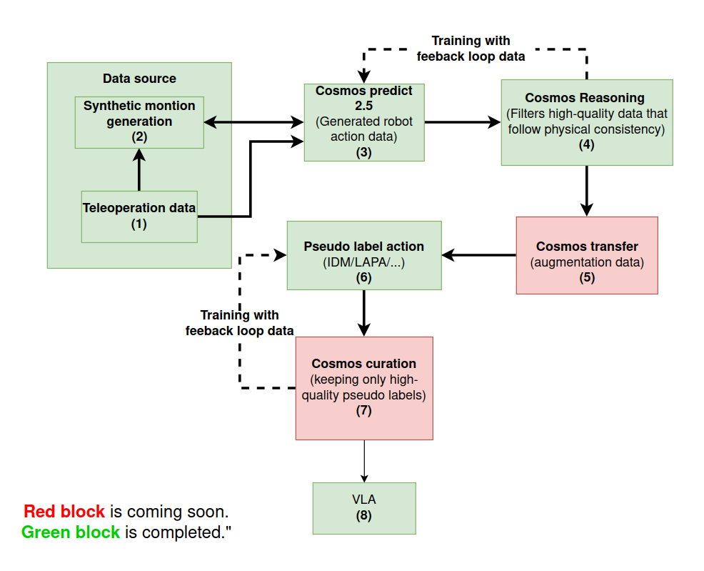
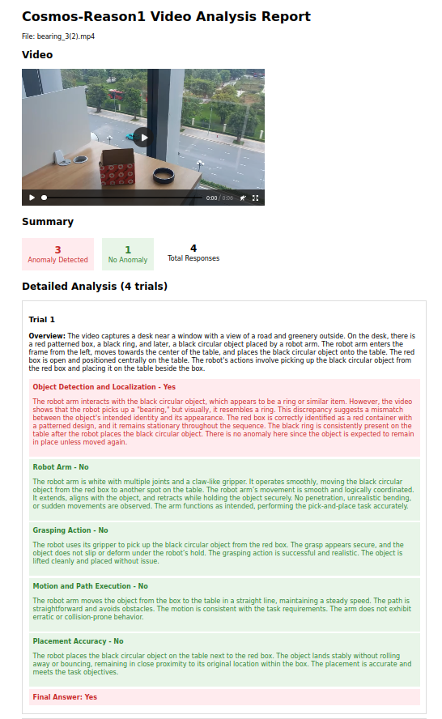

# README #

Automatic data generation pipeline wia Natural Language 



### What is this repository for? ###

* Quick summary
* Version
* [Learn Markdown](https://bitbucket.org/tutorials/markdowndemo)

### How do I get set up? ###

* Summary of set up
* Configuration
* Dependencies
* Database configuration
* How to run tests
* Deployment instructions

### S3 upload / download dataset ###


```bash
aws s3 sync ./ s3://vmo-ai-manipulation/sentk1/server_code/cosmos-predict2.5/datasets
```


## Synthetic montion generation


## Cosmos model
### cosmos training ###

```bash
CUDA_VISIBLE_DEVICES=2,3 WANDB_MODE=disabled torchrun --nproc_per_node=2 --master_port=12341 -m scripts train \
    --config=cosmos_predict2/_src/cosmos_predict2/configs/video2world/config.py \ 
    --job.wandb_mode=disabled ~trainer.callbacks.wandb experiment=predict2_video2world_training_2b_groot_gr1_480
```

### cosmos inference ###

```bash
CUDA_VISIBLE_DEVICES=2,3 torchrun --nproc_per_node=2 --master_port=12341 examples/inference.py \
  -i ./prompt/2.json \
  -o outputs/gr00t_gr1_sample \
  --checkpoint-path $CHECKPOINT_DIR/model_ema_bf16.pt \
  --experiment predict2_video2world_training_2b_groot_gr1_480
```

## Cosmos reason 1

### Reasoning to identify normal synthetic motion / gen video ###



### Generated Video Demo

**Note:** This video demonstrates both successful examples and failure cases of synthetic motion generation.


<video width="640" height="360" controls>
  <source src="./teaser/failure.mp4" type="video/mp4">
  Your browser does not support the video tag.
</video>

```bash
# Commands for validating synthetic motion will go here


```

## IDM model

1. IDM convert data

```bash
python GR00T-Dreams/scripts/generate_stats.py \
  --dataset-path GR00T-Dreams/data/m1_pick_and_place \
  --output-path GR00T-Dreams/IDM_dump/global_metadata/m1/stats.json

```

2. IDM training

3. 

### Contribution guidelines ###

* Writing tests
* Code review
* Other guidelines

### Who do I talk to? ###

* Repo owner or admin
* Other community or team contact